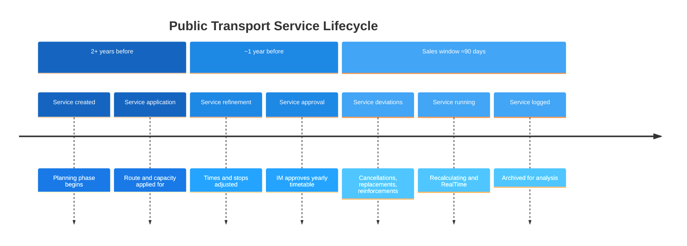

# 🔀 Extended Sales & Deviation Handling

## 1. 🎯 Introduction

Public transport timetables are planned years in advance, yet the operational reality changes constantly: infrastructure works close tracks, seasonal demand spikes require extra capacity, and emergency situations force last-minute cancellations. NeTEx handles this through **DatedServiceJourney** — the object that turns a planned template into a concrete, date-specific instance that can be reinforced, replaced, or cancelled.

This guide explains:
- 🆔 How **DatedServiceJourney.id** serves as the unique sales identifier, replacing the legacy TrainNumber + Date approach
- 📅 How the **sales window** can be extended beyond the yearly timetable approval from infrastructure management — and why that requires a stable, versionable journey identifier
- 🔀 How to model **deviations** (cancellations, replacements, reinforcements) using DatedServiceJourney
- 🔗 The relationship between **ServiceJourney** (template) and **DatedServiceJourney** (dated instance)
- 🔄 How **versioning** drives traveler information when journeys change
- 📝 Worked XML examples for each deviation scenario

---

## 2. 📅 The Sales Window and Timetable Approval

### The Timeline

Public transport services follow a multi-year lifecycle. The diagram below shows how planning, approval, and operations relate in time:



### Two Distinct Planning Horizons

| Horizon | Timeframe | Governed by | NeTEx object |
|---------|-----------|-------------|--------------|
| **Yearly timetable** | Approved ~1 year ahead | Infrastructure management (track access, capacity allocation) | ServiceJourney + DayType |
| **Sales window** | Ideally **beyond** the IM approval horizon | Transport authority / operator | DatedServiceJourney |

The **yearly timetable** is the structural backbone: it defines which services run, on which routes, on which day types. Infrastructure management (IM) approves track access and capacity slots for this period. However, the IM may also revise the approved timetable — for example, rescheduling maintenance windows or reallocating capacity — which means changes can flow from the IM into the sales window even after the initial approval.

The **sales window** is the operational and commercial horizon where tickets become available for purchase. A key goal is to **extend the sales window beyond the IM's yearly timetable approval** — allowing travelers to buy tickets further in advance, even before the infrastructure allocation is finalized. This is possible because:

1. **The ServiceJourney template is stable enough to sell against** — Routes, stop sequences, and approximate times are known well before the IM confirms exact capacity slots. DatedServiceJourney instances can be created from these templates and offered for sale.
2. **Versioning absorbs later changes** — When the IM subsequently approves, adjusts, or revises the timetable, affected DatedServiceJourneys are updated with an incremented version. Travelers who already hold tickets are notified of the change.
3. **The DSJ.id remains the stable anchor** — Even if the journey's details change after the IM approval, the identifier the ticket was sold against (`DatedServiceJourney.id`) stays the same. Only the version changes.

This means the sales window is no longer constrained by the IM approval date. The trade-off: journeys sold before IM approval carry a higher probability of later modification, which makes the versioning and deviation-handling mechanisms described in this guide essential.

> ⚠️ **Key trade-off:** Extending the sales window beyond the IM approval increases commercial opportunity but also increases the likelihood that travelers will experience journey changes. The DatedServiceJourney versioning model is designed specifically to handle this — every change is traceable, and downstream systems can notify travelers automatically.

> 💡 **Key insight:** ServiceJourney represents the *approved timetable plan*. DatedServiceJourney represents *what actually runs on a given date* — including all deviations from the plan. Because `DatedServiceJourney.id` is stable and versionable, tickets can be sold before the IM finalizes the timetable, and any subsequent changes are handled through version increments rather than new identifiers.

---

## 3. 🆔 DatedServiceJourney.id as the Sales Key

Traditionally, a journey sold to a traveler was identified by a combination of **TrainNumber + Date** (and sometimes **+ Operator**). This approach is fragile: train numbers can be reused, operators change, and the composite key has no single authoritative source. Crucially, the legacy approach cannot handle the case where a journey is sold before the IM has confirmed its final details — there is no mechanism to version a TrainNumber.

In this profile, **DatedServiceJourney.id is the unique identifier for sales**. It replaces the legacy composite key with a single, stable reference:

| Approach | Identifier | Weakness |
|----------|-----------|----------|
| Legacy | TrainNumber + Date + Operator | Composite, ambiguous, no single owner |
| NeTEx profile | **DatedServiceJourney.id** | Single, authoritative, versionable |

### Why This Matters for Travelers

When a ticket is sold, it is linked to a specific `DatedServiceJourney.id`. If that journey later changes — whether due to IM rescheduling, operational deviation, or cancellation — the **version** of the DatedServiceJourney is incremented. Downstream systems detect the version change and can:

1. **Notify the traveler** that their booked journey has been modified
2. **Display the change type** — cancellation, replacement, or time adjustment
3. **Offer rebooking** to the replacing journey (linked via `replacedJourneys`)

```text
Ticket sold (before IM approval):
  Journey ref = ERP:DatedServiceJourney:100_0730_20260604  version 1

IM approves yearly timetable → minor time adjustment:
  Journey ref = ERP:DatedServiceJourney:100_0730_20260604  version 2  (planned, times shifted)
  Traveler notified: "Departure time changed from 07:30 to 07:35"

IM reschedules track work → journey replaced:
  Journey ref = ERP:DatedServiceJourney:100_0730_20260604  version 3  (replaced)
  Replacement = ERP:DatedServiceJourney:BUS_100_0745_20260604  version 1
  Traveler notified: "Your train on June 4 has been replaced by a bus departing at 07:45"
```

> 💡 **Tip:** The `DatedServiceJourney.id` remains stable across versions. Version `1` → `2` signals a change; the id itself is the persistent anchor for ticket references, passenger information systems, and SIRI real-time feeds.

### Sources of Change

Changes to a DatedServiceJourney can originate from multiple sources:

| Source | Example | When |
|--------|---------|------|
| **Infrastructure Manager (IM)** | Yearly timetable approval (capacity changes, time shifts), track maintenance rescheduled | Before or during the sales window — this is the most common source when selling beyond the IM horizon |
| **Operator** | Crew shortage, vehicle breakdown | Typically closer to departure |
| **Transport Authority** | Event-driven reinforcements, seasonal adjustments | During the sales window |
| **Real-time operations** | Emergency cancellation | Day of operation |

---

## 4. 🔗 From Plan to Operation

### The Two-Level Model

```text
ServiceJourney "Bus 100 dep. 07:30"         ← Yearly timetable (template)
  │  dayTypes: [Weekdays]
  │  passingTimes: Drammen 07:30 → Asker 07:55 → Oslo 08:25
  │
  ├── DatedServiceJourney "2026-06-02"       ← Planned (runs as normal)
  ├── DatedServiceJourney "2026-06-03"       ← Planned (runs as normal)
  ├── DatedServiceJourney "2026-06-04"       ← Replaced (track work)
  ├── DatedServiceJourney "2026-06-04" (bus) ← Replacement (bus for train)
  ├── DatedServiceJourney "2026-06-05"       ← Reduced capacity (fewer carriages)
  ├── DatedServiceJourney "2026-06-05" (bus) ← Supplementary (bus alongside train)
  └── DatedServiceJourney "2026-06-06"       ← Extra journey (event demand)
```

The ServiceJourney defines *what should run*. Each DatedServiceJourney states *what actually happens on a specific date*.

### When Is a DatedServiceJourney Needed?

| Situation | DatedServiceJourney required? | ServiceAlteration value |
|-----------|-------------------------------|------------------------|
| Normal planned day — no deviations | Optional (implied by DayType) | `planned` (or omitted) |
| Journey cancelled on a specific date | **Yes** | `cancellation` |
| Journey replaced by alternative service | **Yes** (for both old and new) | `replaced` (old); replacing journey uses `replacedJourneys` (no ServiceAlteration needed) |
| Extra journey added (reinforcement) | **Yes** | `extraJourney` |
| Supplementary journey (reduced capacity) | **Yes** (for the supplement) | Original: no ServiceAlteration (still runs); supplement: `extraJourney` + `replacedJourneys` |
| Journey linked to a specific vehicle block | **Yes** | `planned` (with BlockRef) |

---

## 5. 🔀 Deviation Scenarios

### 5a. Cancellation

A planned journey does not operate on a specific date. Typical reasons: infrastructure maintenance, weather, crew shortage.

```xml
<!-- Original planned journey — now cancelled on 2026-06-04 -->
<DatedServiceJourney id="ERP:DatedServiceJourney:100_0730_20260604" version="2">
  <ServiceAlteration>cancellation</ServiceAlteration>
  <ServiceJourneyRef ref="ERP:ServiceJourney:100_0730"/>
  <OperatingDayRef ref="ERP:OperatingDay:2026-06-04"/>
</DatedServiceJourney>
```

**Rules:**
- Version is incremented (from `1` to `2`) when a previously planned DSJ is cancelled.
- Downstream systems (passenger info, ticket sales) must suppress this journey for the date.
- The underlying ServiceJourney remains unchanged — it still operates on other dates.

### 5b. Replacement

A planned journey is replaced by a different service — for example, a replacement bus during track work. Unlike cancellation (no alternative), replacement means the original journey is withdrawn but an alternative is provided.

```xml
<!-- Step 1: Mark the original journey as replaced -->
<DatedServiceJourney id="ERP:DatedServiceJourney:100_0730_20260604" version="2">
  <ServiceAlteration>replaced</ServiceAlteration>
  <ServiceJourneyRef ref="ERP:ServiceJourney:100_0730"/>
  <OperatingDayRef ref="ERP:OperatingDay:2026-06-04"/>
</DatedServiceJourney>

<!-- Step 2: Create the replacing journey referencing the original -->
<DatedServiceJourney id="ERP:DatedServiceJourney:BUS_100_0745_20260604" version="1">
  <ServiceJourneyRef ref="ERP:ServiceJourney:BUS_100_0745"/>
  <replacedJourneys>
    <DatedVehicleJourneyRef ref="ERP:DatedServiceJourney:100_0730_20260604"/>
  </replacedJourneys>
  <OperatingDayRef ref="ERP:OperatingDay:2026-06-04"/>
</DatedServiceJourney>
```

**Rules:**
- The original DSJ is marked with `ServiceAlteration=replaced` — this signals it no longer runs but has a substitute.
- The replacing DSJ uses `replacedJourneys/DatedVehicleJourneyRef` to reference the original. The presence of `replacedJourneys` already indicates this is a replacement, so no `ServiceAlteration` is needed on the replacing DSJ.
- The replacing DSJ may use a different ServiceJourney template (different route, times, or mode).
- Both DSJ entries must share the same OperatingDayRef.

### 5c. Reinforcement (Extra Journey)

An additional journey is added to handle increased demand — for example, a concert or football match.

```xml
<!-- Extra journey on top of the planned one -->
<DatedServiceJourney id="ERP:DatedServiceJourney:100_0730_EXTRA_20260605" version="1">
  <ServiceAlteration>extraJourney</ServiceAlteration>
  <ServiceJourneyRef ref="ERP:ServiceJourney:100_0730"/>
  <OperatingDayRef ref="ERP:OperatingDay:2026-06-05"/>
</DatedServiceJourney>
```

**Rules:**
- The extra DSJ coexists with the planned journey; it does not replace anything.
- It typically references the same ServiceJourney template (same route and times).
- Use BlockRef to assign the extra journey to a different vehicle if needed.

### 5d. Supplementary Journey (Reduced Capacity)

A train operates but with reduced material (fewer carriages), so supplementary buses are added to carry the overflow. The original journey still runs — it is not cancelled or replaced — but it cannot serve all passengers alone.

```xml
<!-- Original train: runs with reduced capacity, NO ServiceAlteration -->
<DatedServiceJourney id="ERP:DatedServiceJourney:100_0730_20260604" version="1">
  <ServiceJourneyRef ref="ERP:ServiceJourney:100_0730"/>
  <OperatingDayRef ref="ERP:OperatingDay:2026-06-04"/>
</DatedServiceJourney>

<!-- Supplementary bus: extraJourney + replacedJourneys linking to the original -->
<DatedServiceJourney id="ERP:DatedServiceJourney:BUS_100_0730_SUPPL_20260604" version="1">
  <ServiceAlteration>extraJourney</ServiceAlteration>
  <ServiceJourneyRef ref="ERP:ServiceJourney:BUS_100_0730"/>
  <replacedJourneys>
    <DatedVehicleJourneyRef ref="ERP:DatedServiceJourney:100_0730_20260604"/>
  </replacedJourneys>
  <OperatingDayRef ref="ERP:OperatingDay:2026-06-04"/>
</DatedServiceJourney>
```

**Rules:**
- The original DSJ receives **no ServiceAlteration** — it still operates, just with reduced capacity.
- The supplementary DSJ uses `ServiceAlteration=extraJourney` combined with `replacedJourneys` referencing the original. This expresses: "I exist because of that journey."
- Semantically this is a known compromise: `replacedJourneys` on an `extraJourney` does not mean the original is replaced — it means the extra journey is *supplementing* the referenced journey.
- The supplementary DSJ may reference a different ServiceJourney template (e.g., a bus route covering the same corridor).
- Both DSJs operate on the same OperatingDay and corridor.

> ⚠️ **Semantic note:** Using `replacedJourneys` on an `extraJourney` stretches the intended meaning of `replacedJourneys`. However, this is the best available mechanism to link a supplementary journey to the journey it supports. Consumers should interpret `extraJourney` + `replacedJourneys` as "supplementing" rather than "replacing."

### 5e. Block-Linked Deviation

When vehicle continuity matters (e.g., a train set must be tracked across multiple trips), use BlockRef:

```xml
<DatedServiceJourney id="ERP:DatedServiceJourney:100_0730_20260605" version="1">
  <ServiceAlteration>planned</ServiceAlteration>
  <BlockRef ref="ERP:Block:TrainSet_42"/>
  <ServiceJourneyRef ref="ERP:ServiceJourney:100_0730"/>
  <OperatingDayRef ref="ERP:OperatingDay:2026-06-05"/>
</DatedServiceJourney>
```

**Rules:**
- All DSJs in the same block must be operationally compatible (no time overlap for the same vehicle).
- The block reference is date-specific — block assignments can change day by day.

---

## 6. 📊 Deviation Flow in the Sales Window

The following sequence illustrates how deviations enter the system during the sales window:

```text
Step 1: Yearly timetable approved
        ServiceJourney templates + DayType assignments published
        ↓
Step 2: Sales window opens (may extend BEYOND IM approval horizon)
        DatedServiceJourney instances created for each date
        ServiceAlteration = planned (or omitted)
        Tickets go on sale — even for dates not yet confirmed by IM
        ↓
Step 3: IM approves or revises the yearly timetable
        Affected DatedServiceJourneys updated (version incremented)
        Travelers notified of any changes
        ↓
Step 4: Further deviation detected (e.g., track work on June 4)
        ↓
Step 5: Affected DatedServiceJourney updated
        - Version incremented
        - ServiceAlteration set to cancellation (no alternative)
          or replaced (alternative provided)
        ↓
Step 6: Replacement/extra journeys created if needed
        - New DatedServiceJourney with replacedJourneys referencing the original
        - ServiceAlteration = extraJourney only for reinforcements
        ↓
Step 7: Downstream systems notified
        - Passenger information updated
        - Ticket sales reflect new availability
        - SIRI real-time feeds aligned
```

> 💡 **Tip:** The sales window is where NeTEx (planned data) and SIRI (real-time data) meet. A DatedServiceJourney cancelled in NeTEx should also be reflected as a SituationExchange in SIRI for real-time passenger information.

---

## 7. ❌ Common Mistakes

| Mistake | Why It Fails | Fix |
|---------|-------------|-----|
| Modifying ServiceJourney to handle a single-day cancellation | Breaks all other dates using this template | Create a DatedServiceJourney with `ServiceAlteration=cancellation` |
| Forgetting to reference the cancelled DSJ from the replacement | No link between old and new journey | Use `replacedJourneys/DatedVehicleJourneyRef` in the replacing DSJ |
| Using DayType to model a one-off deviation | DayType is for recurring patterns, not exceptions | Use DatedServiceJourney + OperatingDay for specific dates |
| Not incrementing version when cancelling | Consumers may miss the update | Always increment `@version` when changing ServiceAlteration |
| Replacement DSJ on a different OperatingDay than the cancelled one | Broken reference integrity | Both must share the same OperatingDayRef |
| Using `cancellation` when the original is replaced | Consumers cannot link old and new journey | Use `replaced` on the original; `cancellation` means no alternative exists |
| Adding `ServiceAlteration` to the replacing DSJ | Redundant and potentially confusing | The `replacedJourneys` element already signals the replacing role |
| Marking the original as `replaced` for reduced capacity | The original still operates — `replaced` means it no longer runs | Leave the original without ServiceAlteration; use `extraJourney` + `replacedJourneys` on the supplement |
| Supplementary journey without `replacedJourneys` | No link between supplement and the journey it supports | Use `replacedJourneys` to reference the original, even though semantics are stretched |

---

## 8. ✅ Best Practices

1. **Keep ServiceJourney stable.** The template should only change between timetable periods. All date-specific adjustments belong to DatedServiceJourney.

2. **Be explicit about ServiceAlteration.** Even when the default is `planned`, consider setting it explicitly for clarity in deviation deliveries.

3. **Version carefully.** A new DatedServiceJourney gets version `1`. When you cancel or modify it later, increment the version. Never reuse a version number. Since `DatedServiceJourney.id` is the sales key, every version increment can trigger traveler notifications.

4. **Link replacements clearly.** Mark the original DSJ as `replaced` *and* reference it from the replacing DSJ via `replacedJourneys`. This gives consumers a complete picture and enables automatic rebooking.

5. **Treat DSJ.id as the stable anchor.** Tickets, SIRI feeds, and passenger information systems all reference `DatedServiceJourney.id`. Keep the id stable; use versioning for changes. Never create a new id for the same journey-on-date unless it is a genuinely new service.

6. **Align with the sales window.** Publish DatedServiceJourney instances as soon as the sales window opens. Update them when deviations are confirmed — whether originating from the IM, operator, or transport authority. This ensures ticket sales and passenger information stay consistent.

7. **Coordinate with SIRI.** Deviations modelled in NeTEx (DatedServiceJourney) should be mirrored in SIRI SituationExchange messages for real-time channels.

---

## 9. 📄 Example: Track Work Deviation

A complete example showing how to handle a 3-day track closure:

> 📄 **Full example:** [Example_ExtendedSales_and_DeviationHandling.xml](Example_ExtendedSales_and_DeviationHandling.xml) — A CompositeFrame delivery with ServiceCalendarFrame (OperatingDays) and TimetableFrame (planned + cancelled + replacement DatedServiceJourneys).

---

## 10. 🔗 Related Resources

### Guides
- [Journey Lifecycle](../JourneyLifecycle/JourneyLifecycle_Guide.md) — The full chain from Line to DatedServiceJourney
- [Get Started](../GetStarted/GetStarted_Guide.md) — NeTEx fundamentals and document anatomy
- [Vehicle Scheduling](../VehicleScheduling/VehicleScheduling_Guide.md) — Block assignment and vehicle continuity

### Objects
- [DatedServiceJourney](../../Objects/DatedServiceJourney/Table_DatedServiceJourney.md) — Element-level specification
- [ServiceJourney](../../Objects/ServiceJourney/Table_ServiceJourney.md) — The reusable timetable template
- [DayType](../../Objects/DayType/Table_DayType.md) — Recurring day patterns
- [OperatingDay](../../Objects/OperatingDay/Table_OperatingDay.md) — Specific calendar dates

### Frames
- [TimetableFrame](../../Frames/TimetableFrame/Table_TimetableFrame.md) — Contains ServiceJourney and DatedServiceJourney
- [ServiceCalendarFrame](../../Frames/ServiceCalendarFrame/Table_ServiceCalendarFrame.md) — Contains DayType, OperatingDay, and DayTypeAssignment
