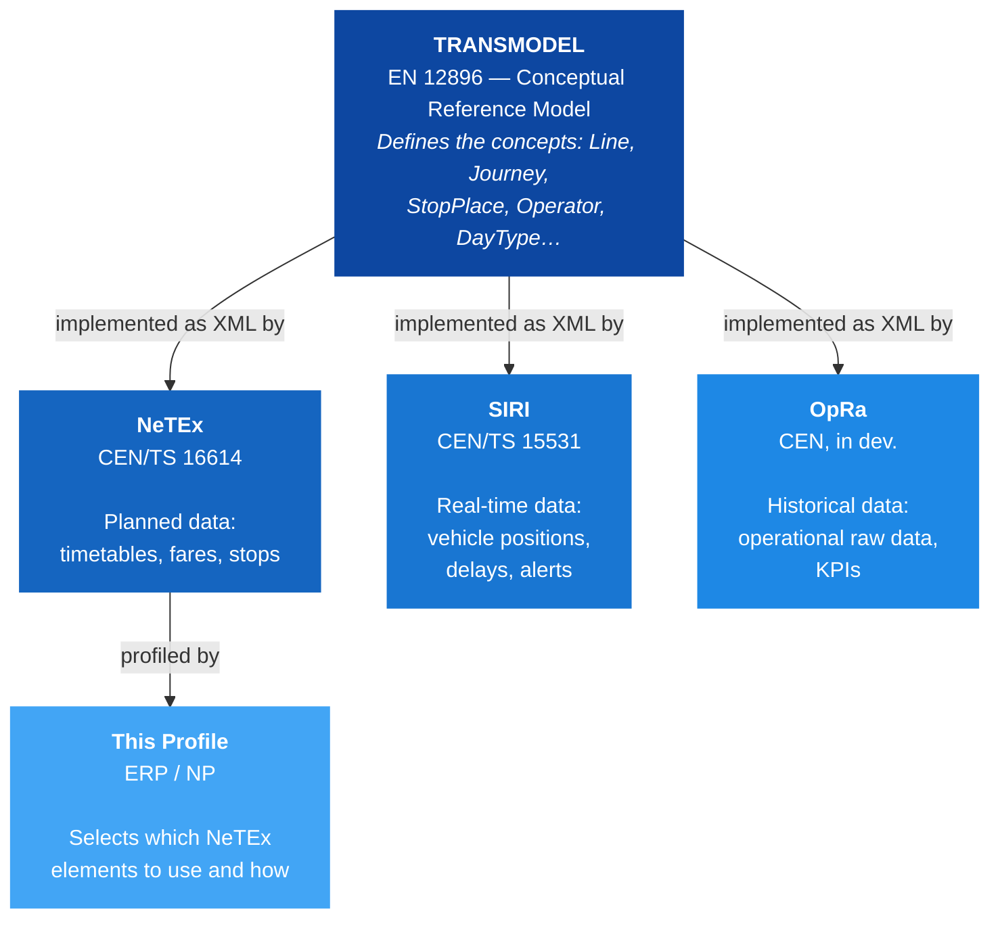
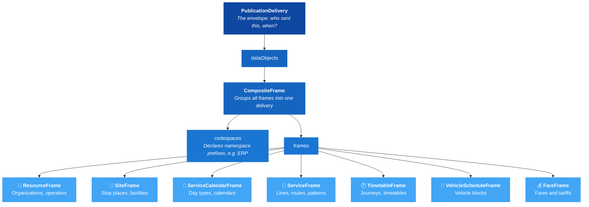

# 🚀 Get Started with NeTEx

## 1. 🎯 Introduction

New to NeTEx? This guide gives you the conceptual foundation you need before diving into the XML. By the end, you'll understand where NeTEx comes from, how it's structured, and how to read a real NeTEx document.

In this guide you will learn:
- 🌍 What Transmodel is and how NeTEx implements it
- 📄 The anatomy of a NeTEx document
- 🏗️ How frames organize data into domains
- 🔍 How to read a real example step by step

---

## 2. 🌍 From Transmodel to NeTEx

### The Big Picture

NeTEx doesn't exist in isolation — it's part of a European standards family for public transport:



### What Each Layer Does

| Layer | Standard | Role |
|-------|----------|------|
| **Transmodel** | EN 12896 | Conceptual model -- defines *what things mean* (Line, Journey, Stop, Operator) |
| **NeTEx** | CEN/TS 16614 | XML schema -- defines *how to exchange planned data* (timetables, fares, stops) |
| **SIRI** | CEN/TS 15531 | XML schema -- defines *how to exchange real-time data* (vehicle monitoring, situation exchange) |
| **OpRa** | CEN (in development) | XML schema -- defines *how to exchange historical operational data* (raw data, KPIs) |
| **This Profile** | ERP / NP | Profile -- defines *which NeTEx elements to use* for a specific context |

> 💡 **Tip:** When you see a NeTEx element like `ServiceJourney`, it maps directly to the Transmodel concept of a "SERVICE JOURNEY" — a planned trip on a specific route. Transmodel defines the semantics, NeTEx defines the XML.

---

## 3. 📄 Anatomy of a NeTEx Document

Every NeTEx file follows the same top-level pattern:



### Key Concepts

**PublicationDelivery** is always the root element. It contains metadata (timestamp, participant) and wraps all data in `dataObjects`.

**CompositeFrame** groups multiple frames into a single delivery unit. Think of it as a "package" — all frames inside can reference each other.

**Frames** separate data by domain. Each frame type holds a specific kind of data. This separation means you can update timetables without touching stop data, or change fares without republishing routes.

For details, see the [CompositeFrame documentation](../../Frames/CompositeFrame/Description_CompositeFrame.md).

---

## 4. 🏗️ Frames and What They Contain

| Frame | Transmodel Domain | What It Holds | Example Objects |
|-------|-------------------|---------------|-----------------|
| [ResourceFrame](../../Frames/ResourceFrame/Description_ResourceFrame.md) | Organizations | Shared resources used by all other frames | Operator, Authority, VehicleType |
| [SiteFrame](../../Frames/SiteFrame/Description_SiteFrame.md) | Fixed Objects | Physical infrastructure | StopPlace, Quay, Parking |
| [ServiceCalendarFrame](../../Frames/ServiceCalendarFrame/Description_ServiceCalendarFrame.md) | Calendar | When services operate | DayType, OperatingDay, OperatingPeriod |
| [ServiceFrame](../../Frames/ServiceFrame/Description_ServiceFrame.md) | Network | Route structure and stop assignments | Line, Route, JourneyPattern, ScheduledStopPoint |
| [TimetableFrame](../../Frames/TimetableFrame/Description_TimetableFrame.md) | Timetable | Journey scheduling | ServiceJourney, DatedServiceJourney |
| [VehicleScheduleFrame](../../Frames/VehicleScheduleFrame/Description_VehicleScheduleFrame.md) | Vehicle Planning | Vehicle assignments | Block, TrainBlock |
| [FareFrame](../../Frames/FareFrame/Description_FareFrame.md) | Fares | Pricing and products | FareZone, TariffZone |

> 💡 **Tip:** You don't need all frames in every delivery. A stop registry might only use SiteFrame. A timetable exchange might use ServiceCalendarFrame + ServiceFrame + TimetableFrame. Include only what's relevant.

---

## 5. 🔍 Reading Your First Example

Let's walk through a real example from this repository — a minimal delivery with four frames:

📄 **Full file:** [Example_CompositeFrame.xml](../../Frames/CompositeFrame/Example_CompositeFrame.xml)

### The Envelope

```xml
<PublicationDelivery xmlns="http://www.netex.org.uk/netex" version="2.0">
  <PublicationTimestamp>2026-03-18T00:00:00Z</PublicationTimestamp>
  <ParticipantRef>EuPro</ParticipantRef>
  <dataObjects>
    <CompositeFrame id="ERP:CompositeFrame:1" version="1">
```

- `PublicationDelivery` — always the root element, with the NeTEx namespace
- `ParticipantRef` — identifies who created this delivery
- `CompositeFrame` — wraps all frames; the `id` uses the format `Codespace:Type:Identifier`

### Shared Resources (ResourceFrame)

```xml
<ResourceFrame id="ERP:ResourceFrame:1" version="1">
  <organisations>
    <Authority id="ERP:Authority:AUT_001" version="1">
      <Name>Example Authority</Name>
    </Authority>
    <Operator id="ERP:Operator:OP_001" version="1">
      <Name>Example Operator</Name>
    </Operator>
  </organisations>
</ResourceFrame>
```

- **Authority** — the public body responsible for transport (Transmodel: AUTHORITY)
- **Operator** — the company running the vehicles (Transmodel: OPERATOR)
- Other frames reference these by `id` — they don't repeat the definitions

### Calendar (ServiceCalendarFrame)

```xml
<ServiceCalendarFrame id="ERP:ServiceCalendarFrame:1" version="1">
  <dayTypes>
    <DayType id="ERP:DayType:WKD" version="1">
      <Name>Weekdays</Name>
      <properties>
        <PropertyOfDay>
          <DaysOfWeek>Monday Tuesday Wednesday Thursday Friday</DaysOfWeek>
        </PropertyOfDay>
      </properties>
    </DayType>
  </dayTypes>
</ServiceCalendarFrame>
```

- **DayType** defines *when* services operate (Transmodel: DAY TYPE)
- Journeys reference DayTypes to say "I run on weekdays" without hardcoding dates

### Network (ServiceFrame)

```xml
<ServiceFrame id="ERP:ServiceFrame:1" version="1">
  <lines>
    <Line id="ERP:Line:L1" version="1">
      <Name>Line 1</Name>
      <PublicCode>1</PublicCode>
      <OperatorRef ref="ERP:Operator:OP_001"/>
    </Line>
  </lines>
</ServiceFrame>
```

- **Line** — a group of routes marketed as one service (Transmodel: LINE)
- `OperatorRef` points back to the ResourceFrame — this is how frames cross-reference

### Timetable (TimetableFrame)

```xml
<TimetableFrame id="ERP:TimetableFrame:1" version="1">
  <vehicleJourneys>
    <ServiceJourney id="ERP:ServiceJourney:SJ_001" version="1">
      <Name>Morning departure</Name>
      <dayTypes>
        <DayTypeRef ref="ERP:DayType:WKD"/>
      </dayTypes>
      <LineRef ref="ERP:Line:L1"/>
    </ServiceJourney>
  </vehicleJourneys>
</TimetableFrame>
```

- **ServiceJourney** — a planned trip (Transmodel: SERVICE JOURNEY)
- `DayTypeRef` links to the calendar, `LineRef` links to the network
- Everything connects through references, never by duplicating data

---

## 6. 🧭 Where to Go Next

Now that you understand the basics, explore further based on your interest:

| Interest | Guide |
|----------|-------|
| How NeTEx XML conventions work (casing, IDs, versioning) | [NeTEx Conventions](../NeTExConventions/NeTEx_Conventions.md) |
| Setting up editors and validation tools | [Tools Guide](../Tools/Tools_Guide.md) |
| How to validate XML against the schema | [Validation Guide](../Validation/Validation.md) |
| How domains stay independent | [Separation of Concerns](../SeparationOfConcerns/SeparationOfConcerns.md) |
| Browse all frames and objects | [Table of Content](../../LLM/Tables/TableOfContent.md) |

### External Resources

| Resource | Link |
|----------|------|
| Transmodel (EN 12896) | [transmodel-cen.eu](https://www.transmodel-cen.eu/) |
| NeTEx CEN Standard | [netex-cen.eu](https://www.netex-cen.eu/) |
| SIRI CEN Standard | [siri-cen.eu](https://www.siri-cen.eu/) |
| Official NeTEx XSD (GitHub) | [NeTEx-CEN/NeTEx](https://github.com/NeTEx-CEN/NeTEx) |
