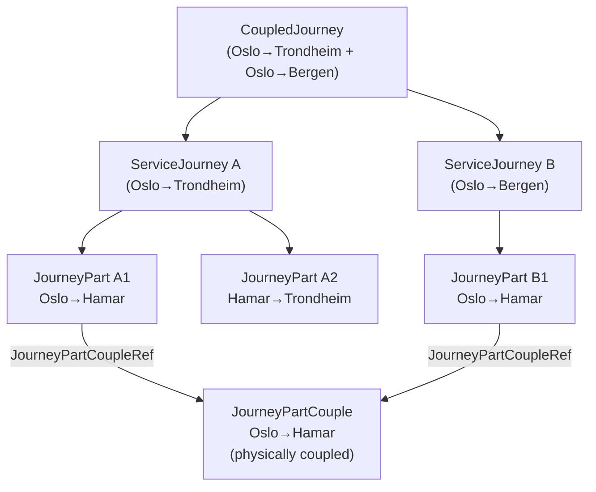
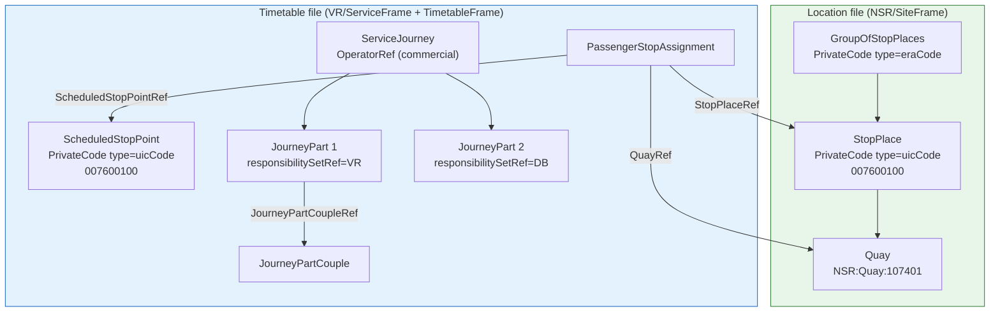

# 🌍 Cross-Border Rail Data Modelling — NeTEx Patterns

## 1. 🎯 Introduction

This guide captures the modelling patterns agreed and clarified during the European NeTEx timetable profile working sessions (April 2026). It covers five interconnected topics that arise specifically when multiple operators, countries, or source systems need to exchange railway timetable data using NeTEx:

1. **Identifying stations across organisational boundaries** — using `PrivateCode` with `@type`
2. **Grouping stops** — `GroupOfStopPlaces` for interchanges and cross-border anchoring
3. **Cross-file delivery** — linking a location file to one or more timetable files via `PassengerStopAssignment`
4. **Supertrains and split/join services** — `JourneyPart`, `JourneyPartCouple`, `CoupledJourney`
5. **Operator handover and responsibility** — `responsibilitySetRef` on `JourneyPart`

> [!TIP]
> Before reading this guide, familiarise yourself with [PassengerStopAssignment](../../Objects/PassengerStopAssignment/Description_PassengerStopAssignment.md), [ScheduledStopPoint](../../Objects/ScheduledStopPoint/Description_ScheduledStopPoint.md), and [ServiceJourney](../../Objects/ServiceJourney/Description_ServiceJourney.md).

---

## 2. 🏷️ Station Identifiers — `PrivateCode` with `@type`

### The problem

A station appears in multiple systems under different identifiers: UIC code, national stop registry ID, ERA code, CRS code, and so on. NeTEx `@id` is owned by the data producer and uses a codespace prefix — it is not suitable as a universal cross-system key. `keyList/KeyValue` is valid but semantically loose (the Key is free text with no schema enforcement).

### The solution — `PrivateCode @type`

`PrivateCode` has an optional `@type` attribute (`xsd:normalizedString`) that names the code system. A single code:

```xml
<StopPlace version="1" id="NSR:StopPlace:337">
    <PrivateCode type="uicCode">007600100</PrivateCode>
    <Name lang="no">Oslo S</Name>
    ...
</StopPlace>
```

When multiple typed codes are needed on the same object, use the **`privateCodes` container** (NeTEx 2.0, `DataManagedObjectGroup`). Each `@type` must be unique within the block:

```xml
<StopPlace version="1" id="NSR:StopPlace:337">
    <privateCodes>
        <PrivateCode type="uicCode">007600100</PrivateCode>
        <PrivateCode type="eraCode">ERA:station:0076:OsloS</PrivateCode>
    </privateCodes>
    <Name lang="no">Oslo S</Name>
    ...
</StopPlace>
```

> [!NOTE]
> `privateCodes` is inherited by **every `DataManagedObject`** in the model — `StopPlace`, `ScheduledStopPoint`, `ServiceJourney`, `JourneyPart`, `ResponsibilitySet`, etc. It is the standard answer to "how do I attach my legacy system's ID to this object?"

### Matching key across files

The same `PrivateCode type="uicCode"` on `ScheduledStopPoint` in the timetable file creates a durable, schema-grounded matching key to the `StopPlace` in the location file — without requiring either file to change its `@id`:

```
Location file    StopPlace           PrivateCode type="uicCode" = 007600100
Timetable file   ScheduledStopPoint  PrivateCode type="uicCode" = 007600100
```

---

## 3. 🗂️ `GroupOfStopPlaces` — Interchange Hubs and Cross-Border Anchors

`GroupOfStopPlaces` groups `StopPlace` records for a specific purpose without changing their `@id` or ownership. Two use cases are relevant in the cross-border context:

### 3a. Logical interchange hub

Multiple `StopPlace` records (different modes, different operators) at the same physical hub:

```xml
<!-- PurposeOfGrouping defined in ResourceFrame — it is a full NeTEx TypeOfValue object,
     not a free-text string. Reference it via PurposeOfGroupingRef/@ref -->
<ResourceFrame version="1" id="NSR:ResourceFrame:1">
    <typesOfValue>
        <PurposeOfGrouping version="1" id="NSR:PurposeOfGrouping:interchange">
            <Name>Interchange hub</Name>
        </PurposeOfGrouping>
    </typesOfValue>
</ResourceFrame>

<GroupOfStopPlaces version="1" id="NSR:GroupOfStopPlaces:OsloS">
    <Name lang="no">Oslo S — sentralt knutepunkt</Name>
    <PurposeOfGroupingRef ref="NSR:PurposeOfGrouping:interchange" version="1"/>
    <members>
        <StopPlaceRef ref="NSR:StopPlace:337"/>   <!-- Oslo S rail -->
        <StopPlaceRef ref="NSR:StopPlace:59872"/>  <!-- Oslo Bussterminal -->
    </members>
</GroupOfStopPlaces>
```

### 3b. EU-level identifier anchor

When a central EU registry assigns a cross-border identifier to a logical station, it can be stored on the `GroupOfStopPlaces` via `privateCodes` — no changes to national `StopPlace` records:

```xml
<GroupOfStopPlaces version="1" id="NSR:GroupOfStopPlaces:OsloS">
    <privateCodes>
        <PrivateCode type="eraCode">ERA:station:0076:OsloS</PrivateCode>
    </privateCodes>
    <Name lang="no">Oslo S</Name>
    <PurposeOfGroupingRef ref="NSR:PurposeOfGrouping:interchange" version="1"/>
    <members>
        <StopPlaceRef ref="NSR:StopPlace:337"/>
    </members>
</GroupOfStopPlaces>
```

> [!NOTE]
> Whether `GroupOfStopPlaces` is the right anchor for EU-level station IDs is an open profile decision — see [European Profile Discussion Agenda](European_Profile_Discussion_Agenda.md) Topic 11–12.

See: [GroupOfStopPlaces description](../../Objects/GroupOfStopPlaces/Description_GroupOfStopPlaces.md) | [Example XML](../../Objects/GroupOfStopPlaces/Example_GroupOfStopPlaces_NP.xml)

---

## 4. 📂 Cross-File Delivery — Location File + Timetable File

### Delivery structure

Railway timetable data is typically delivered in two files:

| File | Owner | Contents |
|------|-------|----------|
| **Location file** | National stop registry (e.g. NSR) | `SiteFrame` — `StopPlace` + `Quay` records |
| **Timetable file(s)** | Train operator (e.g. VR, SJ) | `ServiceFrame` — `ScheduledStopPoint`, `PassengerStopAssignment`; `TimetableFrame` — `ServiceJourney`, `DatedServiceJourney` |

### `PassengerStopAssignment` as the cross-file bridge

`PassengerStopAssignment` lives in the timetable file's `ServiceFrame` and carries references into the location file:

```
Timetable file (ServiceFrame — VR)
  ScheduledStopPoint  id="VR:ScheduledStopPoint:007600100"
                      PrivateCode type="uicCode" = 007600100

  PassengerStopAssignment
    ScheduledStopPointRef  ref="VR:ScheduledStopPoint:007600100"  version="1"   ← own file, include version
    StopPlaceRef           ref="NSR:StopPlace:337"                              ← external, NO version
    QuayRef                ref="NSR:Quay:107401"                               ← external, NO version

Location file (SiteFrame — NSR)
  StopPlace  id="NSR:StopPlace:337"
             PrivateCode type="uicCode" = 007600100
    Quay  id="NSR:Quay:107401"
```

**Version rule:** references to objects in the **same file** include `@version`. References to objects in **another file or registry** omit `@version`.

The UIC code on both sides is the durable matching key — a consumer can join the two files without either changing its `@id` structure.

See: [Example_CrossFile_UIC_NP.xml](../../Objects/PassengerStopAssignment/Example_CrossFile_UIC_NP.xml)

---

## 5. 🚆 Supertrains — `JourneyPart`, `JourneyPartCouple`, `CoupledJourney`

### ServiceJourney = carriage continuity

A `ServiceJourney` represents a travel opportunity defined by **carriage continuity**: a passenger can remain seated from origin to destination without relocating. This is independent of the train number:

- A single train number may produce **multiple ServiceJourneys** after a consist split
- A single ServiceJourney may span **multiple train numbers** through working
- The `parts/JourneyPart` structure expresses the internal segments of a ServiceJourney

### Structure overview



### Example XML

```xml
<!-- TimetableFrame -->

<!-- ServiceJourney A — Oslo to Trondheim (carriage continuity for this traveller) -->
<ServiceJourney version="1" id="VR:ServiceJourney:45_TRD">
    <PrivateCode type="trainNumber">IC45</PrivateCode>
    <JourneyPatternRef ref="VR:JourneyPattern:45_TRD"/>
    <OperatorRef ref="VR:Operator:1"/>
    <parts>
        <!-- Coupled segment Oslo→Hamar: physically shares consist with ServiceJourney B -->
        <JourneyPart version="1" id="VR:JourneyPart:45_TRD_OSL_HAM" order="1">
            <PrivateCode type="trainNumber">IC45</PrivateCode>
            <JourneyPartCoupleRef ref="VR:JourneyPartCouple:IC45_IC67_OSL_HAM"/>
            <MainPartRef ref="VR:JourneyPart:45_TRD_OSL_HAM"/>
            <FromStopPointRef ref="VR:ScheduledStopPoint:Oslo"/>
            <ToStopPointRef ref="VR:ScheduledStopPoint:Hamar"/>
            <StartTime>09:00:00</StartTime>
            <EndTime>10:30:00</EndTime>
        </JourneyPart>
        <!-- Solo segment Hamar→Trondheim: only IC45 carriages continue -->
        <JourneyPart version="1" id="VR:JourneyPart:45_TRD_HAM_TRD" order="2">
            <PrivateCode type="trainNumber">IC45</PrivateCode>
            <FromStopPointRef ref="VR:ScheduledStopPoint:Hamar"/>
            <ToStopPointRef ref="VR:ScheduledStopPoint:Trondheim"/>
            <StartTime>10:30:00</StartTime>
            <EndTime>14:10:00</EndTime>
        </JourneyPart>
    </parts>
    <passingTimes><!-- ... --></passingTimes>
</ServiceJourney>

<!-- ServiceJourney B — Oslo to Bergen (different traveller, different carriage group) -->
<ServiceJourney version="1" id="VR:ServiceJourney:67_BGO">
    <PrivateCode type="trainNumber">IC67</PrivateCode>
    <JourneyPatternRef ref="VR:JourneyPattern:67_BGO"/>
    <OperatorRef ref="VR:Operator:1"/>
    <parts>
        <JourneyPart version="1" id="VR:JourneyPart:67_BGO_OSL_HAM" order="1">
            <PrivateCode type="trainNumber">IC67</PrivateCode>
            <JourneyPartCoupleRef ref="VR:JourneyPartCouple:IC45_IC67_OSL_HAM"/>
            <MainPartRef ref="VR:JourneyPart:45_TRD_OSL_HAM"/>
            <FromStopPointRef ref="VR:ScheduledStopPoint:Oslo"/>
            <ToStopPointRef ref="VR:ScheduledStopPoint:Hamar"/>
            <StartTime>09:00:00</StartTime>
            <EndTime>10:30:00</EndTime>
        </JourneyPart>
        <!-- Solo segment Hamar→Bergen continues independently -->
    </parts>
    <passingTimes><!-- ... --></passingTimes>
</ServiceJourney>

<!-- JourneyPartCouple — the physical coupling on the Oslo→Hamar segment -->
<JourneyPartCouple version="1" id="VR:JourneyPartCouple:IC45_IC67_OSL_HAM">
    <FromStopPointRef ref="VR:ScheduledStopPoint:Oslo"/>
    <ToStopPointRef ref="VR:ScheduledStopPoint:Hamar"/>
    <MainPartRef ref="VR:JourneyPart:45_TRD_OSL_HAM"/>
    <journeyParts>
        <JourneyPartRef ref="VR:JourneyPart:45_TRD_OSL_HAM"/>
        <JourneyPartRef ref="VR:JourneyPart:67_BGO_OSL_HAM"/>
    </journeyParts>
</JourneyPartCouple>

<!-- CoupledJourney — the overall combined service -->
<CoupledJourney version="1" id="VR:CoupledJourney:IC45_IC67">
    <Name>IC45/IC67 Oslo S</Name>
    <journeys>
        <ServiceJourneyRef ref="VR:ServiceJourney:45_TRD"/>
        <ServiceJourneyRef ref="VR:ServiceJourney:67_BGO"/>
    </journeys>
</CoupledJourney>
```

### Key facts from the XSD

| Object | `TrainNumberRef` | `facilities` | `responsibilitySetRef` |
|--------|-----------------|-------------|----------------------|
| `ServiceJourney` | Via `trainNumbers` container | `facilities` | ✅ (DataManagedObject) |
| `JourneyPart` | ✅ `TrainNumberRef` | ✅ `facilities` | ✅ (DataManagedObject) |
| `JourneyPartCouple` | ✅ `TrainNumberRef` | — | ✅ (DataManagedObject) |

---

## 6. 🏢 Operator Handover — `responsibilitySetRef` on `JourneyPart`

### The problem with `OperatorRef`

`OperatorRef` conflates two concerns: the organisation and the role it plays. An `Operator` object says who the organisation is; `OperatorRef` on a `ServiceJourney` implies "this organisation operates this journey" without formal role semantics. For a cross-border service where traction changes at a border station, `OperatorRef` at the `ServiceJourney` level can only name one operator for the whole journey.

### The solution — `responsibilitySetRef` on `JourneyPart`

`JourneyPart` is a `DataManagedObject`. Every `DataManagedObject` in NeTEx inherits `@responsibilitySetRef` — an attribute pointing to a `ResponsibilitySet` that formally names who is responsible and in what role.

The XSD documents the fallback rule:
> *"If absent, then responsibility is same as for containing context of this object."*

This means:
- Set `@responsibilitySetRef` on a `JourneyPart` to override for that segment only
- Leave it absent on other parts to inherit from the `ServiceJourney`

```xml
<!-- ResourceFrame — define responsibility sets with explicit roles -->
<ResponsibilitySet version="1" id="VR:ResponsibilitySet:VRTraction">
    <Name>VR traction responsibility</Name>
    <roles>
        <ResponsibilityRoleAssignment version="1" id="VR:ResponsibilityRoleAssignment:1">
            <StakeholderRoleType>operates</StakeholderRoleType>
            <ResponsibleOrganisationRef ref="VR:Operator:1"/>
        </ResponsibilityRoleAssignment>
    </roles>
</ResponsibilitySet>

<ResponsibilitySet version="1" id="DB:ResponsibilitySet:DBTraction">
    <Name>DB traction responsibility</Name>
    <roles>
        <ResponsibilityRoleAssignment version="1" id="DB:ResponsibilityRoleAssignment:1">
            <StakeholderRoleType>operates</StakeholderRoleType>
            <ResponsibleOrganisationRef ref="DB:Operator:1"/>
        </ResponsibilityRoleAssignment>
    </roles>
</ResponsibilitySet>

<!-- TimetableFrame — operator handover at border station -->
<ServiceJourney version="1" id="VR:ServiceJourney:EC123">
    <OperatorRef ref="VR:Operator:1"/>  <!-- Commercially responsible operator -->
    <parts>
        <!-- VR operates Helsinki→Helsinki Airport segment -->
        <JourneyPart version="1" id="VR:JourneyPart:EC123_HEL_HIA" order="1"
            responsibilitySetRef="VR:ResponsibilitySet:VRTraction">
            <PrivateCode type="trainNumber">EC123</PrivateCode>
            <FromStopPointRef ref="VR:ScheduledStopPoint:Helsinki"/>
            <ToStopPointRef ref="VR:ScheduledStopPoint:HelsinkiAirport"/>
            <StartTime>08:00:00</StartTime>
            <EndTime>08:30:00</EndTime>
        </JourneyPart>
        <!-- DB takes over traction from the border station onward -->
        <JourneyPart version="1" id="VR:JourneyPart:EC123_HIA_BER" order="2"
            responsibilitySetRef="DB:ResponsibilitySet:DBTraction">
            <PrivateCode type="trainNumber">EC123</PrivateCode>
            <FromStopPointRef ref="VR:ScheduledStopPoint:HelsinkiAirport"/>
            <ToStopPointRef ref="VR:ScheduledStopPoint:Berlin"/>
            <StartTime>08:30:00</StartTime>
            <EndTime>16:00:00</EndTime>
        </JourneyPart>
    </parts>
    <passingTimes><!-- ... --></passingTimes>
</ServiceJourney>
```

`ResponsibilitySet` is also a `DataManagedObject` and can carry `privateCodes` — useful for referencing external role codes (e.g. ERA role identifiers):

```xml
<ResponsibilitySet version="1" id="DB:ResponsibilitySet:DBTraction">
    <privateCodes>
        <PrivateCode type="eraRoleCode">ERA:RS:0085:traction</PrivateCode>
    </privateCodes>
    ...
</ResponsibilitySet>
```

---

## 7. 🔗 How It All Connects



---

## 8. 📋 Summary of Patterns

| Topic | Mechanism | Key rule |
|-------|-----------|----------|
| Station identifier | `PrivateCode @type="uicCode"` on `StopPlace` and `ScheduledStopPoint` | Same value = matching key; no `@id` change required |
| Multiple external codes | `privateCodes` container (NeTEx 2.0) | `@type` must be unique within the container |
| EU-level station anchor | `GroupOfStopPlaces` with `privateCodes type="eraCode"` | Owned by registry; members are national `StopPlace` refs |
| Cross-file reference | `PassengerStopAssignment` — `ScheduledStopPointRef` (own file, with `@version`), `QuayRef`/`StopPlaceRef` (external, no `@version`) | Version rule distinguishes own vs. external |
| Supertrain | `ServiceJourney/parts/JourneyPart` + `JourneyPartCouple` + `CoupledJourney` | One ServiceJourney per carriage-continuous traveller opportunity |
| Train number per segment | `TrainNumberRef` on `JourneyPart` | Replaces single `PrivateCode` on ServiceJourney when numbers differ per segment |
| Operator handover | `@responsibilitySetRef` on `JourneyPart` | Absent = inherits from ServiceJourney context |
| External role codes | `privateCodes` on `ResponsibilitySet` | Universal — available on every `DataManagedObject` |

---

## 9. 🔗 Related References

| Resource | Link |
|----------|------|
| PassengerStopAssignment | [Description](../../Objects/PassengerStopAssignment/Description_PassengerStopAssignment.md) · [Cross-file example](../../Objects/PassengerStopAssignment/Example_CrossFile_UIC_NP.xml) |
| ScheduledStopPoint | [Description](../../Objects/ScheduledStopPoint/Description_ScheduledStopPoint.md) |
| GroupOfStopPlaces | [Description](../../Objects/GroupOfStopPlaces/Description_GroupOfStopPlaces.md) · [Example](../../Objects/GroupOfStopPlaces/Example_GroupOfStopPlaces_NP.xml) |
| ServiceJourney | [Description](../../Objects/ServiceJourney/Description_ServiceJourney.md) |
| Network Timetable Guide | [Guide](../NetworkTimetable/NetworkTimetable_Guide.md) |
| UIC Migration Guide | [Guide](UIC_EDIFACT_Migration_Guide.md) |
| European Profile Discussion Agenda | [Agenda](European_Profile_Discussion_Agenda.md) |
