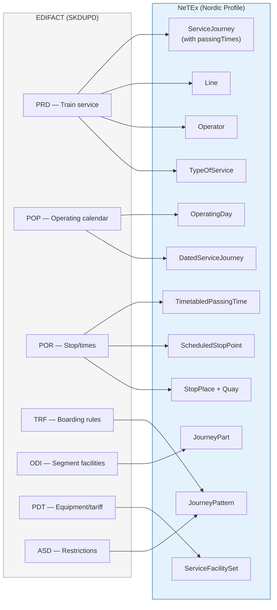
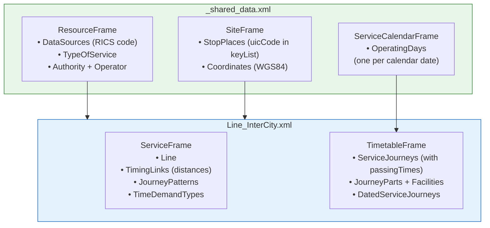
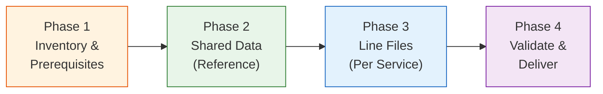

# 🚂 UIC EDIFACT to NeTEx — Migration Guide (Nordic Profile)

## 1. 🎯 Introduction

This guide is for railway operators and data engineers **adopting NeTEx XML** as their timetable data format, replacing UIC EDIFACT (SKDUPD/TSDUPD messages), aligned with the **Nordic Profile**. The goal is to produce NeTEx natively — not to translate EDIFACT files, but to stop producing EDIFACT altogether. It explains how NeTEx models the concepts you know from EDIFACT, provides a step-by-step migration workflow, and includes concrete NeTEx production examples drawn from real Finnish Railways (VR) production data.

**EDIFACT** (Electronic Data Interchange for Administration, Commerce and Transport) has been the UIC standard for exchanging railway timetable data via the **MERITS** system. **NeTEx** (CEN/TS 16614) is the modern European replacement, offering richer semantics, XML tooling support, and alignment with the Transmodel reference model.

In this guide you will learn:
- 🗺️ How to produce NeTEx objects and frames — using your EDIFACT knowledge as a reference point
- 🏷️ Nordic Profile conventions: codespaces, ID patterns, data ownership
- 📦 How to structure NeTEx files for railway timetable delivery
- 🔄 A step-by-step migration workflow for replacing your EDIFACT production pipeline
- 📋 Lookup tables for codes, facilities, and transport modes
- ⚠️ Common pitfalls and how to avoid them

> [!TIP]
> If you're new to NeTEx, start with the [Get Started guide](../GetStarted/GetStarted_Guide.md) and the [Network Timetable guide](../NetworkTimetable/NetworkTimetable_Guide.md) first. This guide assumes familiarity with NeTEx frames and objects.

### Reference Examples

This guide is accompanied by real production examples from Finnish Railways (VR):

| File | Description |
|------|-------------|
| [Example_VR_InterCity.xml](Example_VR_InterCity.xml) | Complete line file: ServiceFrame + TimetableFrame with ServiceJourneys, TimetabledPassingTimes, JourneyParts, and DatedServiceJourneys |
| [Example_shared_VR.xml](Example_shared_VR.xml) | Shared data file: ResourceFrame (Operators, TypeOfService), SiteFrame (StopPlaces with UIC codes), ServiceCalendarFrame (OperatingDays) |
| [Example_stops_TSDUPD.xml](Example_stops_TSDUPD.xml) | NSR integration example: ScheduledStopPoints from external stop registry |
| [Example_SKDUPD_output.r](Example_SKDUPD_output.r) | Generated EDIFACT SKDUPD output for reference |

---

## 2. 🏷️ Nordic Profile Conventions

The Nordic Profile defines specific conventions for codespaces, IDs, data ownership, and file structure that **must be followed** when producing NeTEx rail timetable data.

### 2.1 Codespace & ID Pattern

Every NeTEx object requires a globally unique ID using the pattern:

```
<Codespace>:<ObjectType>:<LocalId>
```

The codespace is declared in the CompositeFrame and defines the operator's namespace:

```xml
<codespaces>
    <Codespace id="vr">
        <Xmlns>vr</Xmlns>
        <XmlnsUrl>http://www.operator.fi/</XmlnsUrl>
        <Description>Operator's data</Description>
    </Codespace>
</codespaces>
```

**ID examples from VR production data:**

| Object | ID Example | Notes |
|--------|------------|-------|
| Line | `VR:Line:InterCity` | Descriptive name as LocalId |
| ServiceJourney | `VR:ServiceJourney:1` | Train number as LocalId |
| ScheduledStopPoint | `VR:ScheduledStopPoint:001002326` | UIC station code as LocalId |
| StopPlace | `VR:StopPlace:001002326` | UIC station code as LocalId |
| OperatingDay | `VR:OperatingDay:2026-01-04` | ISO date as LocalId |
| DatedServiceJourney | `VR:DatedServiceJourney:1_2026-01-05` | TrainNumber_Date pattern |
| JourneyPattern | `VR:JourneyPattern:X` | Pattern variant as LocalId |
| Operator | `VR:Operator:1` | Sequential or RICS-based |
| DestinationDisplay | `VR:DestinationDisplay:JOENSUU` | Destination name as LocalId |

### 2.2 Data Ownership

In the Nordic Profile, data ownership is separated between **central registries** and **operator deliveries**:

| Data Source | Owns | Referenced By |
|-------------|------|---------------|
| **Central registry** (e.g., NSR/Tiamat) | StopPlace, Quay, TopographicPlace, Authority, Operator, TariffZone | Operator data references these by `@ref` without `@version` |
| **Operator delivery** | Line, Route, JourneyPattern, ServiceJourney, DatedServiceJourney, DayType, OperatingDay, ScheduledStopPoint, PassengerStopAssignment, DestinationDisplay, Notice | Produced by the operator; includes `@version` |

> [!IMPORTANT]
> When referencing objects from an external registry (e.g., NSR StopPlace), **omit the `version` attribute** on the `*Ref` element. Only include `version` for references to objects within the same delivery.

### 2.3 Train Number Semantics

The Nordic Profile uses two distinct codes on ServiceJourney:

```xml
<ServiceJourney version="1" id="VR:ServiceJourney:1">
    <PrivateCode>1</PrivateCode>   <!-- Production/internal train number -->
    <PublicCode>1</PublicCode>      <!-- Advertised train number for passengers -->
</ServiceJourney>
```

| Element | EDIFACT Source | Purpose |
|---------|---------------|---------|
| `PrivateCode` | PRD service number | Internal system identifier |
| `PublicCode` | PRD service number | Public-facing train number |

### 2.4 TypeOfService

Service brands (EDIFACT brand codes) map to `TypeOfService` objects in the ResourceFrame:

```xml
<typesOfValue>
    <TypeOfService version="1" id="VR:TypeOfService:HighSpeed">
        <Name>High-speed train</Name>
        <PrivateCode>8</PrivateCode>
    </TypeOfService>
    <TypeOfService version="1" id="VR:TypeOfService:InterCity">
        <Name>InterCity</Name>
        <PrivateCode>9</PrivateCode>
    </TypeOfService>
</typesOfValue>
```

Referenced from ServiceJourney:
```xml
<TypeOfServiceRef ref="VR:TypeOfService:HighSpeed"/>
```

### 2.5 RICS Code Storage

The RICS operator code is stored as a `KeyValue` in the DataSource and as `PrivateCode` on the organisation:

```xml
<DataSource version="1" id="VR:DataSource:1">
    <keyList>
        <KeyValue>
            <Key>RICS code</Key>
            <Value>0010</Value>
        </KeyValue>
    </keyList>
    <Name>Valtionrautatiet</Name>
    <PrivateCode>0010</PrivateCode>
</DataSource>

<Operator version="1" id="VR:Operator:1">
    <keyList>
        <KeyValue>
            <Key>RICS</Key>
            <Value>0010</Value>
        </KeyValue>
    </keyList>
    <PrivateCode>0010</PrivateCode>
    <Name>VR</Name>
</Operator>
```

---

## 3. 🏗️ EDIFACT Message Structure Overview

A UIC SKDUPD message is a flat, segment-based format describing train services:

```
UIB+UNOB:4+2026-04-20T093459'                    ← Message envelope
UIH+SKDUPD:D:04A+1+2026-04-20T093459'            ← Update header
MSD+AAR:61'                                       ← Message status (Add/Amend/Replace)
ORG+0000+++0000'                                  ← Organisation (RICS code)
HDR+81+273:2026-04-17/2027-04-20*45+<ref>'        ← Header with validity

PRD+1880:::37:::+1076**92'                        ← Train 1880, rail, RICS 1076, regional
POP+273:2024-12-05/2024-12-14::1111111111'        ← Runs daily 5-14 Dec
POR+007602361+*0900+*4'                           ← Helsinki dep 09:00, platform 4
TRF+1'                                            ← No alighting (origin)
POR+007612360+0903*0903+1*1'                      ← Pasila arr/dep 09:03
POR+007602324+0944+11*'                           ← Tikkurila arr 09:44 (terminus)
TRF+2'                                            ← No boarding (terminus)
ODI+007602361*007602324+1*9'                      ← Segment: stop 1 to 9
PDT++:::92:::'                                    ← Equipment: regional rail

UIT+1+<count>'                                    ← Trailer
UIZ+<reference>+1'                                ← Close
```

Each message typically describes **one train service** with its stops, times, operating calendar, and on-board facilities.

---

## 4. 🗺️ NeTEx Data Model: From EDIFACT Concepts to NeTEx

The following diagram shows how the concepts you know from EDIFACT are represented in NeTEx's structured model. When building your NeTEx production pipeline, these are the objects you will create:



### Key Structural Differences

| Aspect | EDIFACT | NeTEx (Nordic Profile) |
|--------|---------|----------------------|
| **Format** | Flat segments, positional | Hierarchical XML, named elements |
| **Stop identity** | UIC numeric code (e.g., `007602361`) | Structured ID (e.g., `VR:ScheduledStopPoint:001002326`) with logical/physical separation |
| **Stop times** | HHMM in POR segment | `TimetabledPassingTime` with `ArrivalTime` / `DepartureTime` (HH:MM:SS) |
| **Calendar** | Bit pattern in POP (1=runs, 0=doesn't) | Individual OperatingDay + DatedServiceJourney per date |
| **Operator** | RICS code in PRD | Operator object with RICS as `PrivateCode` + `KeyValue` |
| **Service brand** | Brand code in PRD (63, 92, 101) | `TypeOfService` in ResourceFrame + `TransportSubmode` |
| **Facilities** | Inline codes in ODI/PDT | `ServiceFacilitySet` referenced from `JourneyPart` |
| **Boarding rules** | Numeric codes (1, 2, 4) | `ForAlighting`/`ForBoarding` booleans per `StopPointInJourneyPattern` |

---

## 5. 📊 Producing NeTEx — Guided by EDIFACT Concepts

### 5.1 Train Service (PRD) → ServiceJourney + Line + Operator

The PRD segment defines the train identity, mode, and operator.

| EDIFACT Field | Example | NeTEx Object | NeTEx Element |
|---------------|---------|--------------|---------------|
| Service number | `1880` | ServiceJourney | `PrivateCode`, `PublicCode` |
| Service mode | `37` (rail) | ServiceJourney | `TransportMode` |
| Service provider | `1076` (RICS) | Operator | `PrivateCode` + `keyList` |
| Brand code | `92` (regional) | ServiceJourney | `TransportSubmode`, `TypeOfServiceRef` |

**EDIFACT:**
```
PRD+1880:::37:::+1076**92'
```

**NeTEx (Nordic Profile):**
```xml
<!-- ResourceFrame (_shared file) -->
<Operator version="1" id="VR:Operator:1">
    <keyList>
        <KeyValue>
            <Key>RICS</Key>
            <Value>0010</Value>
        </KeyValue>
    </keyList>
    <PrivateCode>0010</PrivateCode>
    <Name>VR</Name>
</Operator>

<!-- ServiceFrame (line file) -->
<Line version="1" id="VR:Line:InterCity">
    <Name>InterCity</Name>
    <TransportMode>rail</TransportMode>
    <PublicCode>InterCity</PublicCode>
    <OperatorRef ref="VR:Operator:1"/>
</Line>

<!-- TimetableFrame (line file) -->
<ServiceJourney version="1" id="VR:ServiceJourney:1">
    <PrivateCode>1</PrivateCode>
    <PublicCode>1</PublicCode>
    <TransportMode>rail</TransportMode>
    <TransportSubmode>
        <RailSubmode>longDistance</RailSubmode>
    </TransportSubmode>
    <TypeOfServiceRef ref="VR:TypeOfService:HighSpeed"/>
    <JourneyPatternRef ref="VR:JourneyPattern:X"/>
    <OperatorRef ref="VR:Operator:1"/>
    <LineRef ref="VR:Line:InterCity"/>
    <!-- passingTimes follow -->
</ServiceJourney>
```

---

### 5.2 Operating Calendar (POP) → OperatingDay + DatedServiceJourney

The POP segment defines when a train runs using a date range and a bitfield.

**EDIFACT:**
```
POP+273:2024-12-05/2024-12-14::1111111111'
```

This means: train runs daily from 5 Dec to 14 Dec (all 10 days).

**NeTEx (Nordic Profile):**

Each date the train runs becomes an OperatingDay + DatedServiceJourney pair:

```xml
<!-- ServiceCalendarFrame (_shared file) -->
<operatingDays>
    <OperatingDay version="1" id="VR:OperatingDay:2026-01-04">
        <CalendarDate>2026-01-04</CalendarDate>
    </OperatingDay>
    <OperatingDay version="1" id="VR:OperatingDay:2026-01-05">
        <CalendarDate>2026-01-05</CalendarDate>
    </OperatingDay>
    <!-- ... one per operating date ... -->
</operatingDays>

<!-- TimetableFrame (line file) -->
<DatedServiceJourney version="1" id="VR:DatedServiceJourney:1_2026-01-04">
    <ServiceJourneyRef ref="VR:ServiceJourney:1_Sun"/>
    <OperatingDayRef ref="VR:OperatingDay:2026-01-04"/>
</DatedServiceJourney>
<DatedServiceJourney version="1" id="VR:DatedServiceJourney:1_2026-01-05">
    <ServiceJourneyRef ref="VR:ServiceJourney:1"/>
    <OperatingDayRef ref="VR:OperatingDay:2026-01-05"/>
</DatedServiceJourney>
```

> [!NOTE]
> The EDIFACT bit pattern `1010111101` maps to specific dates. Different ServiceJourney variants (e.g., `VR:ServiceJourney:1_Sun` for Sundays vs `VR:ServiceJourney:1` for weekdays) can be selected per DatedServiceJourney.

### Day-of-Week Variants

When a train has different stop patterns on certain days (e.g., a shorter route on Sundays), create separate ServiceJourney + JourneyPattern variants. The DatedServiceJourney selects the correct variant per date:

```xml
<!-- Weekday variant (13 stops) -->
<ServiceJourney version="1" id="VR:ServiceJourney:1">
    <JourneyPatternRef ref="VR:JourneyPattern:X"/>
    <!-- full set of passingTimes -->
</ServiceJourney>

<!-- Sunday variant (5 stops) -->
<ServiceJourney version="1" id="VR:ServiceJourney:1_Sun">
    <JourneyPatternRef ref="VR:JourneyPattern:Sunday"/>
    <!-- shorter set of passingTimes -->
</ServiceJourney>

<!-- DSJ selects the correct variant -->
<DatedServiceJourney version="1" id="VR:DatedServiceJourney:1_2026-01-04">
    <ServiceJourneyRef ref="VR:ServiceJourney:1_Sun"/>  <!-- Sunday -->
    <OperatingDayRef ref="VR:OperatingDay:2026-01-04"/>
</DatedServiceJourney>
<DatedServiceJourney version="1" id="VR:DatedServiceJourney:1_2026-01-05">
    <ServiceJourneyRef ref="VR:ServiceJourney:1"/>      <!-- Weekday -->
    <OperatingDayRef ref="VR:OperatingDay:2026-01-05"/>
</DatedServiceJourney>
```

---

### 5.3 Stop Times (POR) → TimetabledPassingTime + ScheduledStopPoint + StopPlace

Stop times are modelled using **`TimetabledPassingTime`** elements inside the ServiceJourney's `passingTimes` collection, referencing stops via `StopPointInJourneyPatternRef`.

**EDIFACT:**
```
POR+007602361+*0900+*4'                     ← Helsinki, dep 09:00, platform 4
TRF+1'                                      ← No alighting (origin)
POR+007612360+0903*0903+1*1'               ← Pasila, arr/dep 09:03
POR+007602324+0944+11*'                    ← Tikkurila, arr 09:44
TRF+2'                                      ← No boarding (terminus)
```

**NeTEx (Nordic Profile) — StopPlace in shared file:**
```xml
<StopPlace version="1" id="VR:StopPlace:001002326">
    <keyList>
        <KeyValue>
            <Key>uicCode</Key>
            <Value>001002326</Value>
        </KeyValue>
    </keyList>
    <Name>Helsinki</Name>
    <ShortName>HKI</ShortName>
    <PrivateCode>001002326</PrivateCode>
    <Centroid>
        <Location>
            <Longitude>24.941249</Longitude>
            <Latitude>60.172095</Latitude>
        </Location>
    </Centroid>
    <StopPlaceType>railStation</StopPlaceType>
</StopPlace>
```

**NeTEx (Nordic Profile) — passingTimes in ServiceJourney:**
```xml
<ServiceJourney version="1" id="VR:ServiceJourney:1">
    <DepartureTime>06:57:00</DepartureTime>
    <JourneyPatternRef ref="VR:JourneyPattern:X"/>
    <OperatorRef ref="VR:Operator:1"/>
    <LineRef ref="VR:Line:InterCity"/>
    <passingTimes>
        <TimetabledPassingTime>
            <StopPointInJourneyPatternRef
                ref="VR:StopPointInJourneyPattern:1@001002326@X" version="0"/>
            <DepartureTime>06:57:00</DepartureTime>
        </TimetabledPassingTime>
        <TimetabledPassingTime>
            <StopPointInJourneyPatternRef
                ref="VR:StopPointInJourneyPattern:1@001000010@X" version="0"/>
            <ArrivalTime>07:02:00</ArrivalTime>
            <DepartureTime>07:03:00</DepartureTime>
        </TimetabledPassingTime>
        <TimetabledPassingTime>
            <StopPointInJourneyPatternRef
                ref="VR:StopPointInJourneyPattern:1@001000018@X" version="0"/>
            <ArrivalTime>07:12:00</ArrivalTime>
            <DepartureTime>07:14:00</DepartureTime>
        </TimetabledPassingTime>
        <!-- ... intermediate stops ... -->
        <TimetabledPassingTime>
            <StopPointInJourneyPatternRef
                ref="VR:StopPointInJourneyPattern:1@001000460@X" version="0"/>
            <ArrivalTime>11:43:10</ArrivalTime>
        </TimetabledPassingTime>
    </passingTimes>
</ServiceJourney>
```

#### UIC Code Mapping

The 9-digit UIC station code maps to NeTEx as follows:

| UIC Code | Station | NeTEx ScheduledStopPoint ID | NeTEx StopPlace |
|----------|---------|-----------------------------|-----------------|
| `007602361` | Helsinki | `VR:ScheduledStopPoint:001002326` | `VR:StopPlace:001002326` with `keyList.uicCode=001002326` |

> [!IMPORTANT]
> The UIC code stored in EDIFACT POR segments (`007602361` — 9 digits with country prefix `00` + check digits) may differ from the station code used in the operator's NeTEx delivery (`001002326`). Map carefully using the `keyList` → `uicCode` field on StopPlace.

#### Time Format Conversion

| EDIFACT | NeTEx | Notes |
|---------|-------|-------|
| `0903` (HHMM) | `09:03:00` (HH:MM:SS) | Add seconds |
| `:::1` (day offset) | `<ArrivalDayOffset>1</ArrivalDayOffset>` | Next-day arrival |
| Empty arrival | Omit `ArrivalTime` element | First stop has `DepartureTime` only |
| Empty departure | Omit `DepartureTime` element | Last stop has `ArrivalTime` only |

---

### 5.4 Boarding/Alighting Rules (TRF/ASD) → StopPointInJourneyPattern

Boarding and alighting restrictions are modelled on the `StopPointInJourneyPattern` in the JourneyPattern:

| EDIFACT Code | Meaning | NeTEx Element |
|--------------|---------|---------------|
| `1` | No alighting | `ForAlighting = false` |
| `2` | No boarding | `ForBoarding = false` |
| `4` | Both disallowed | Both `false` |
| `230` | Request stop | `RequestStop = true` |

```xml
<JourneyPattern version="1" id="VR:JourneyPattern:X">
    <pointsInSequence>
        <StopPointInJourneyPattern order="1" version="0"
            id="VR:StopPointInJourneyPattern:1@001002326@X">
            <ScheduledStopPointRef ref="VR:ScheduledStopPoint:001002326"/>
            <ForAlighting>false</ForAlighting>
            <DestinationDisplayRef ref="VR:DestinationDisplay:JOENSUU"/>
        </StopPointInJourneyPattern>
        <StopPointInJourneyPattern order="2" version="0"
            id="VR:StopPointInJourneyPattern:1@001000010@X">
            <ScheduledStopPointRef ref="VR:ScheduledStopPoint:001000010"/>
            <ForAlighting>false</ForAlighting>
        </StopPointInJourneyPattern>
        <!-- ... intermediate stops (default: both true) ... -->
        <StopPointInJourneyPattern order="13" version="0"
            id="VR:StopPointInJourneyPattern:1@001000460@X">
            <ScheduledStopPointRef ref="VR:ScheduledStopPoint:001000460"/>
            <ForBoarding>false</ForBoarding>
        </StopPointInJourneyPattern>
    </pointsInSequence>
</JourneyPattern>
```

---

### 5.5 On-Board Facilities (ODI/PDT) → JourneyPart + ServiceFacilitySet

Facilities that apply to journey segments are modelled as `ServiceFacilitySet` objects referenced by `JourneyPart`:

**EDIFACT:**
```
ODI+007602361*007602324+1*9'
PDT++:::92:::'
```

**NeTEx (Nordic Profile) — inside ServiceJourney:**
```xml
<parts>
    <JourneyPart version="1" id="1@001002326+001000460" order="1">
        <MainPartRef version="1" ref="1@001002326+001000460"/>
        <FromStopPointRef ref="VR:ScheduledStopPoint:001002326"/>
        <ToStopPointRef ref="VR:ScheduledStopPoint:001000460"/>
        <StartTime>06:57:00</StartTime>
        <EndTime>11:43:10</EndTime>
        <facilities>
            <ServiceFacilitySetRef ref="1@63"/>    <!-- longDistance brand -->
            <ServiceFacilitySetRef ref="1@F4"/>    <!-- firstClass -->
            <ServiceFacilitySetRef ref="1@F5"/>    <!-- secondClass -->
            <ServiceFacilitySetRef ref="1@F48"/>   <!-- familyCarriage -->
            <ServiceFacilitySetRef ref="1@R13"/>   <!-- reservationsCompulsory -->
        </facilities>
    </JourneyPart>
</parts>
```

### 5.6 Station Data (TSDUPD) → SiteFrame

Station data from the TSDUPD message maps to the SiteFrame with StopPlace + Quay objects:

```xml
<SiteFrame version="1" id="VR:SiteFrame:1">
    <stopPlaces>
        <StopPlace version="1" id="VR:StopPlace:001002326">
            <keyList>
                <KeyValue>
                    <Key>uicCode</Key>
                    <Value>001002326</Value>
                </KeyValue>
            </keyList>
            <Name>Helsinki</Name>
            <ShortName>HKI</ShortName>
            <PrivateCode>001002326</PrivateCode>
            <Centroid>
                <Location>
                    <Longitude>24.941249</Longitude>
                    <Latitude>60.172095</Latitude>
                </Location>
            </Centroid>
            <StopPlaceType>railStation</StopPlaceType>
        </StopPlace>
        <!-- ... additional stations ... -->
    </stopPlaces>
</SiteFrame>
```

---

## 6. 📋 Code Mapping Tables

### 6.1 Transport Mode Codes

Source: [mapping_service_mode.txt](mapping_service_mode.txt)

| EDIFACT Code | EDIFACT Meaning | NeTEx TransportMode | NeTEx TransportSubmode |
|-------------|-----------------|--------------------|-----------------------|
| `37` | Rail | `rail` | *(see brand table)* |
| `32` | Bus | `bus` | `railReplacementBus` (if replacement) |
| `34` | Taxi | `taxi` | — |

### 6.2 Brand / Transport Submode Codes

Source: [mapping_brand.txt](mapping_brand.txt)

| EDIFACT Brand | Meaning | NeTEx RailSubmode | NeTEx TypeOfService |
|---------------|---------|-------------------|---------------------|
| `63` | Long distance | `longDistance` | `TypeOfService:HighSpeed` or `TypeOfService:InterCity` |
| `92` | Regional rail | `regionalRail` | — |
| `101` | Night rail | `nightRail` | — |
| `162` | Rail replacement bus | *(use `bus` mode + `railReplacementBus` submode)* | — |

### 6.3 Facility Mapping

Source: [mapping_facility.txt](mapping_facility.txt)

| EDIFACT Code | Meaning | NeTEx Property | NeTEx Value |
|-------------|---------|----------------|-------------|
| `F4` | First/premium class | `FareClasses` | `firstClass` |
| `F5` | Second class | `FareClasses` | `secondClass` |
| `F11` | Single sleeper | `AccommodationAccessList` | `singleSleeper` |
| `F13` | Double sleeper | `AccommodationAccessList` | `doubleSleeper` |
| `F24` | Baby compartment | `AccommodationAccessList` | `babyCompartment` |
| `F26` | Cycles allowed | `ServiceFacilityList` | `cyclesAllowed` |
| `F28` | Wheelchair accessible | `MobilityFacilityList` | `wheelchair` |
| `F47` | Bistro/café | `ServiceFacilityList` | `bistro` |
| `F48` | Family carriage | `ServiceFacilityList` | `familyCarriage` |
| `S25` | Trolley service | `ServiceFacilityList` | `trolley` |
| `S46` | Public wifi | `ServiceFacilityList` | `wifi` |
| `R11` | Reservations possible | `ServiceReservationFacilityList` | `reservationsPossible` |
| `R13` | Reservations compulsory | `ServiceReservationFacilityList` | `reservationsCompulsory` |

### 6.4 Traffic Restriction Codes

| EDIFACT Code | Meaning | NeTEx Element |
|-------------|---------|---------------|
| `1` | No alighting | `ForAlighting = false` |
| `2` | No boarding | `ForBoarding = false` |
| `4` | No boarding or alighting | Both `false` |
| `230` | Request stop | `RequestStop = true` |

---

## 7. 📦 NeTEx File Structure for Railway Timetables

Following the [Network Timetable guide](../NetworkTimetable/NetworkTimetable_Guide.md), a migrated railway timetable is split into two file types. See the VR examples for the actual structure.

### File Structure

| File | Example | Contents |
|------|---------|----------|
| Shared data | [Example_shared_VR.xml](Example_shared_VR.xml) | ResourceFrame (DataSources, TypeOfService, Authority, Operator), SiteFrame (StopPlaces with UIC codes), ServiceCalendarFrame (OperatingDays) |
| Line file | [Example_VR_InterCity.xml](Example_VR_InterCity.xml) | ServiceFrame (Line, TimingLinks, JourneyPatterns, TimeDemandTypes), TimetableFrame (ServiceJourneys with passingTimes, DatedServiceJourneys) |

### Frame Allocation (Nordic Profile)



### FrameDefaults

Both files declare frame defaults for timezone and coordinate system:

```xml
<FrameDefaults>
    <DefaultLocale>
        <TimeZone>Europe/Helsinki</TimeZone>
        <DefaultLanguage>fi</DefaultLanguage>
    </DefaultLocale>
    <DefaultLocationSystem>4326</DefaultLocationSystem>
</FrameDefaults>
```

---

## 8. 🔄 Step-by-Step: Replacing Your EDIFACT Pipeline with NeTEx

### Phase 1: Inventory & Prerequisites

1. **Catalogue your existing EDIFACT data** — List all SKDUPD/TSDUPD messages, train services, and operators to understand the scope of what NeTEx must cover
2. **Map UIC station codes** — Create a lookup from UIC codes to NeTEx StopPlace/Quay IDs using a national stop registry (e.g., NSR/Tiamat)
3. **Map RICS codes** — Create a lookup from RICS operator codes to NeTEx Operator objects. Store RICS as both `PrivateCode` and `keyList` KeyValue
4. **Define your Codespace** — Choose your operator prefix (e.g., `VR`, `SJ`, `NSB`) and XmlnsUrl
5. **Define TypeOfService brands** — Map EDIFACT brand codes to TypeOfService objects

### Phase 2: Build Reference Data (Shared File)

6. **Create ResourceFrame** — DataSources with RICS, TypeOfService definitions, Authority and Operator with RICS in `keyList`
7. **Create SiteFrame** — Convert TSDUPD stations to StopPlace objects with `uicCode` in `keyList`, coordinates in WGS84, and `StopPlaceType = railStation`
8. **Create ServiceCalendarFrame** — One OperatingDay per calendar date covered by any service. ID pattern: `<Codespace>:OperatingDay:<ISO date>`

### Phase 3: Produce Line Files (Per Train Service)

9. **Create Line** — Group related train services. Use descriptive name as LocalId
10. **Create JourneyPattern** — Define stop sequences. Include `ForAlighting`/`ForBoarding` rules (equivalent to TRF/ASD). Create variants for day-of-week differences (e.g., `JourneyPattern:X` vs `JourneyPattern:Sunday`)
11. **Create TimingLinks** — Produce links with distances between consecutive stops
12. **Create ServiceJourney** — Produce a ServiceJourney with `passingTimes` containing `TimetabledPassingTime` elements. Each TimetabledPassingTime references a `StopPointInJourneyPatternRef` and includes `ArrivalTime` / `DepartureTime`. Include `PrivateCode`, `PublicCode`, `TransportMode`, `TransportSubmode`, `TypeOfServiceRef`. Model facilities as JourneyParts with ServiceFacilitySetRefs
13. **Create DatedServiceJourneys** — For each date the service runs, produce one DatedServiceJourney linking the correct ServiceJourney variant to the OperatingDay. Select the right variant (e.g., Sunday vs weekday pattern)

### Phase 4: Validate & Deliver

14. **Validate against XSD** — Use the NeTEx XSD schema (see [Validation guide](../Validation/Validation.md))
15. **Cross-reference check** — Verify all `*Ref` elements resolve. External refs (to central registries) should omit `version`
16. **Test with consumers** — Load shared file first, then each line file
17. **Deliver** — Publish the shared file + line files as a dataset



---

## 9. 🔀 Complete NeTEx Production Example

### Source reference: EDIFACT SKDUPD (from [Example_SKDUPD_output.r](Example_SKDUPD_output.r))

The EDIFACT below represents the service data that the NeTEx output must fully express. The goal is to produce the NeTEx — the EDIFACT is provided only as a reference for what data is available.

```
PRD+1880:::37:::+1076**92'
POP+273:2024-12-05/2024-12-14::1111111111'
POR+007602361+*0900+*4'
TRF+1'
POR+007612360+0903*0903+1*1'
POR+007602360+0906*0906+1*1'
POR+007602359+0918*0918+1*1'
POR+007642358+0922*0922+1*1'
POR+007622358+0930*0931+1*1'
POR+007612358+0936*0936+1*1'
POR+007602358+0939*0940+1*1'
POR+007602324+0944+11*'
TRF+2'
ODI+007602361*007602324+1*9'
PDT++:::92:::'
```

### NeTEx XML output (Nordic Profile)

**Shared file** (`_shared_data.xml`):
```xml
<?xml version="1.0" encoding="UTF-8"?>
<PublicationDelivery xmlns="http://www.netex.org.uk/netex" version="1.0">
  <PublicationTimestamp>2024-12-01T12:00:00</PublicationTimestamp>
  <ParticipantRef>VR</ParticipantRef>
  <dataObjects>
    <CompositeFrame version="1" id="VR:CompositeFrame:Shared">
      <codespaces>
        <Codespace id="vr">
          <Xmlns>vr</Xmlns>
          <XmlnsUrl>http://www.operator.fi/</XmlnsUrl>
          <Description>Operator's data</Description>
        </Codespace>
      </codespaces>
      <FrameDefaults>
        <DefaultLocale>
          <TimeZone>Europe/Helsinki</TimeZone>
          <DefaultLanguage>fi</DefaultLanguage>
        </DefaultLocale>
        <DefaultLocationSystem>4326</DefaultLocationSystem>
      </FrameDefaults>
      <frames>

        <!-- ===== ResourceFrame ===== -->
        <ResourceFrame version="1" id="VR:ResourceFrame:RF1">
          <dataSources>
            <DataSource version="1" id="VR:DataSource:1">
              <keyList>
                <KeyValue>
                  <Key>RICS code</Key>
                  <Value>0010</Value>
                </KeyValue>
              </keyList>
              <Name>Valtionrautatiet</Name>
              <PrivateCode>0010</PrivateCode>
            </DataSource>
          </dataSources>
          <typesOfValue>
            <TypeOfService version="1" id="VR:TypeOfService:InterCity">
              <Name>InterCity</Name>
              <PrivateCode>9</PrivateCode>
            </TypeOfService>
          </typesOfValue>
          <organisations>
            <Authority version="1" id="VR:Authority:1">
              <keyList>
                <KeyValue>
                  <Key>RICS</Key>
                  <Value>0010</Value>
                </KeyValue>
              </keyList>
              <PrivateCode>0010</PrivateCode>
              <Name>VR</Name>
            </Authority>
            <Operator version="1" id="VR:Operator:1">
              <keyList>
                <KeyValue>
                  <Key>RICS</Key>
                  <Value>0010</Value>
                </KeyValue>
              </keyList>
              <PrivateCode>0010</PrivateCode>
              <Name>VR</Name>
            </Operator>
          </organisations>
        </ResourceFrame>

        <!-- ===== SiteFrame ===== -->
        <SiteFrame version="1" id="VR:SiteFrame:1">
          <stopPlaces>
            <StopPlace version="1" id="VR:StopPlace:001002326">
              <keyList>
                <KeyValue>
                  <Key>uicCode</Key>
                  <Value>001002326</Value>
                </KeyValue>
              </keyList>
              <Name>Helsinki</Name>
              <ShortName>HKI</ShortName>
              <PrivateCode>001002326</PrivateCode>
              <Centroid>
                <Location>
                  <Longitude>24.941249</Longitude>
                  <Latitude>60.172095</Latitude>
                </Location>
              </Centroid>
              <StopPlaceType>railStation</StopPlaceType>
            </StopPlace>
            <StopPlace version="1" id="VR:StopPlace:001000010">
              <keyList>
                <KeyValue>
                  <Key>uicCode</Key>
                  <Value>001000010</Value>
                </KeyValue>
              </keyList>
              <Name>Pasila</Name>
              <ShortName>PSL</ShortName>
              <PrivateCode>001000010</PrivateCode>
              <Centroid>
                <Location>
                  <Longitude>24.933522</Longitude>
                  <Latitude>60.198685</Latitude>
                </Location>
              </Centroid>
              <StopPlaceType>railStation</StopPlaceType>
            </StopPlace>
            <!-- ... additional stops ... -->
          </stopPlaces>
        </SiteFrame>

        <!-- ===== ServiceCalendarFrame ===== -->
        <ServiceCalendarFrame version="1" id="VR:ServiceCalendarFrame:SCF1">
          <operatingDays>
            <OperatingDay version="1" id="VR:OperatingDay:2024-12-05">
              <CalendarDate>2024-12-05</CalendarDate>
            </OperatingDay>
            <OperatingDay version="1" id="VR:OperatingDay:2024-12-06">
              <CalendarDate>2024-12-06</CalendarDate>
            </OperatingDay>
            <!-- ... one per operating date in the bit pattern ... -->
            <OperatingDay version="1" id="VR:OperatingDay:2024-12-14">
              <CalendarDate>2024-12-14</CalendarDate>
            </OperatingDay>
          </operatingDays>
        </ServiceCalendarFrame>

      </frames>
    </CompositeFrame>
  </dataObjects>
</PublicationDelivery>
```

**Line file** (`Line_InterCity.xml`):
```xml
<?xml version="1.0" encoding="UTF-8"?>
<PublicationDelivery xmlns="http://www.netex.org.uk/netex" version="1.0">
  <PublicationTimestamp>2024-12-01T12:00:00</PublicationTimestamp>
  <ParticipantRef>VR</ParticipantRef>
  <dataObjects>
    <CompositeFrame version="1" id="VR:CompositeFrame:InterCity">
      <codespaces>
        <Codespace id="vr">
          <Xmlns>vr</Xmlns>
          <XmlnsUrl>http://www.operator.fi/</XmlnsUrl>
        </Codespace>
      </codespaces>
      <FrameDefaults>
        <DefaultLocale>
          <TimeZone>Europe/Helsinki</TimeZone>
          <DefaultLanguage>fi</DefaultLanguage>
        </DefaultLocale>
      </FrameDefaults>
      <frames>

        <!-- ===== ServiceFrame ===== -->
        <ServiceFrame version="1" id="VR:ServiceFrame:InterCity">
          <lines>
            <Line version="1" id="VR:Line:InterCity">
              <Name>InterCity</Name>
              <TransportMode>rail</TransportMode>
              <PublicCode>InterCity</PublicCode>
              <OperatorRef ref="VR:Operator:1"/>
            </Line>
          </lines>
          <journeyPatterns>
            <JourneyPattern version="1" id="VR:JourneyPattern:1880">
              <pointsInSequence>
                <StopPointInJourneyPattern order="1" version="0"
                    id="VR:StopPointInJourneyPattern:1880@001002326">
                  <ScheduledStopPointRef ref="VR:ScheduledStopPoint:001002326"/>
                  <ForAlighting>false</ForAlighting>
                </StopPointInJourneyPattern>
                <StopPointInJourneyPattern order="2" version="0"
                    id="VR:StopPointInJourneyPattern:1880@001000010">
                  <ScheduledStopPointRef ref="VR:ScheduledStopPoint:001000010"/>
                </StopPointInJourneyPattern>
                <!-- ... intermediate stops ... -->
                <StopPointInJourneyPattern order="9" version="0"
                    id="VR:StopPointInJourneyPattern:1880@001002324">
                  <ScheduledStopPointRef ref="VR:ScheduledStopPoint:001002324"/>
                  <ForBoarding>false</ForBoarding>
                </StopPointInJourneyPattern>
              </pointsInSequence>
            </JourneyPattern>
          </journeyPatterns>
        </ServiceFrame>

        <!-- ===== TimetableFrame ===== -->
        <TimetableFrame version="1" id="VR:TimetableFrame:InterCity">
          <vehicleJourneys>
            <ServiceJourney version="1" id="VR:ServiceJourney:1880">
              <PrivateCode>1880</PrivateCode>
              <PublicCode>1880</PublicCode>
              <TransportMode>rail</TransportMode>
              <TransportSubmode>
                <RailSubmode>regionalRail</RailSubmode>
              </TransportSubmode>
              <DepartureTime>09:00:00</DepartureTime>
              <JourneyPatternRef ref="VR:JourneyPattern:1880"/>
              <OperatorRef ref="VR:Operator:1"/>
              <LineRef ref="VR:Line:InterCity"/>
              <parts>
                <JourneyPart version="1" id="1880@001002326+001002324" order="1">
                  <MainPartRef version="1" ref="1880@001002326+001002324"/>
                  <FromStopPointRef ref="VR:ScheduledStopPoint:001002326"/>
                  <ToStopPointRef ref="VR:ScheduledStopPoint:001002324"/>
                  <facilities>
                    <ServiceFacilitySetRef ref="1880@92"/>
                  </facilities>
                </JourneyPart>
              </parts>
              <passingTimes>
                <TimetabledPassingTime>
                  <StopPointInJourneyPatternRef
                    ref="VR:StopPointInJourneyPattern:1880@001002326" version="0"/>
                  <DepartureTime>09:00:00</DepartureTime>
                </TimetabledPassingTime>
                <TimetabledPassingTime>
                  <StopPointInJourneyPatternRef
                    ref="VR:StopPointInJourneyPattern:1880@001000010" version="0"/>
                  <ArrivalTime>09:03:00</ArrivalTime>
                  <DepartureTime>09:03:00</DepartureTime>
                </TimetabledPassingTime>
                <TimetabledPassingTime>
                  <StopPointInJourneyPatternRef
                    ref="VR:StopPointInJourneyPattern:1880@001000018" version="0"/>
                  <ArrivalTime>09:06:00</ArrivalTime>
                  <DepartureTime>09:06:00</DepartureTime>
                </TimetabledPassingTime>
                <!-- ... intermediate stops ... -->
                <TimetabledPassingTime>
                  <StopPointInJourneyPatternRef
                    ref="VR:StopPointInJourneyPattern:1880@001002324" version="0"/>
                  <ArrivalTime>09:44:00</ArrivalTime>
                </TimetabledPassingTime>
              </passingTimes>
            </ServiceJourney>

            <!-- DatedServiceJourneys — one per operating date -->
            <DatedServiceJourney version="1" id="VR:DatedServiceJourney:1880_2024-12-05">
              <ServiceJourneyRef ref="VR:ServiceJourney:1880"/>
              <OperatingDayRef ref="VR:OperatingDay:2024-12-05"/>
            </DatedServiceJourney>
            <DatedServiceJourney version="1" id="VR:DatedServiceJourney:1880_2024-12-06">
              <ServiceJourneyRef ref="VR:ServiceJourney:1880"/>
              <OperatingDayRef ref="VR:OperatingDay:2024-12-06"/>
            </DatedServiceJourney>
            <!-- ... one DSJ per date the train runs ... -->
          </vehicleJourneys>
        </TimetableFrame>

      </frames>
    </CompositeFrame>
  </dataObjects>
</PublicationDelivery>
```

---

## 10. ⚠️ Common Pitfalls

| Pitfall | Problem | Solution |
|---------|---------|----------|
| **UIC code varies** | EDIFACT POR uses 9-digit codes with country prefix; operator may use shorter codes | Map via StopPlace `keyList` → `uicCode`. The LocalId in ScheduledStopPoint may differ from the EDIFACT UIC code. |
| **Calls vs passingTimes** | NeTEx supports both patterns | Use `passingTimes` with `TimetabledPassingTime` + `StopPointInJourneyPatternRef`. Note: `calls/Call` in NeTEx is formally defined as a **view** — a derived, read-optimised projection over the underlying `passingTimes` + `JourneyPattern` data, not a separate creation mechanism. Producing the `calls` view natively can yield a richer, more explicit stop representation, but correctly resolving all the implicit JourneyPattern logic it must express in full makes implementation significantly more demanding. For a first adoption of NeTEx the effort is rarely justified; `passingTimes` is the recommended production path. |
| **Missing TypeOfService** | EDIFACT brand code has no direct NeTEx equivalent | Create `TypeOfService` objects in ResourceFrame and reference from ServiceJourney. |
| **Flat calendar** | POP bit pattern doesn't express recurring patterns | Use individual OperatingDay + DatedServiceJourney per date. Create variant ServiceJourneys for different day patterns (weekday vs Sunday). |
| **Missing Line grouping** | EDIFACT has no explicit line concept | Group services with the same route/brand into Line objects. |
| **Overnight journeys** | EDIFACT `:::1` day offset | Use `<ArrivalDayOffset>1</ArrivalDayOffset>` on TimetabledPassingTime. |
| **ServiceAlteration** | EDIFACT may carry cancelled/replaced services | Use `ServiceAlteration` attribute on DatedServiceJourney: `cancellation`, `replaced`, `extraJourney`. |
| **External stop references** | Stops from central registry (NSR) | Omit `version` on Refs to external objects. Use the registry's codespace (e.g., `NSR:Quay:Q819`). |
| **RICS in multiple places** | RICS code needed on DataSource, Authority, and Operator | Store as both `PrivateCode` and `keyList` → `KeyValue` with Key `RICS` or `RICS code`. |
| **Date-specific overrides** | One day has different timing | Create a separate ServiceJourney variant for that date and point the DatedServiceJourney to the variant. |

---

## 11. 🔗 Reference Links

| Resource | Description |
|----------|-------------|
| [Get Started Guide](../GetStarted/GetStarted_Guide.md) | NeTEx basics and terminology |
| [Network Timetable Guide](../NetworkTimetable/NetworkTimetable_Guide.md) | Complete timetable data delivery guide |
| [Calendar Guide](../Calendar/Calendar_Guide.md) | DayType, OperatingDay, and scheduling patterns |
| [Journey Lifecycle Guide](../JourneyLifecycle/JourneyLifecycle_Guide.md) | ServiceJourney → DatedServiceJourney flow |
| [Stop Infrastructure Guide](../StopInfrastructure/StopInfrastructure_Guide.md) | StopPlace, Quay, and stop assignments |
| [Validation Guide](../Validation/Validation.md) | XSD validation and quality checks |
| [NeTEx Conventions](../NeTExConventions/NeTEx_Conventions.md) | ID formats, versioning, and naming rules |

### Bundled Reference Assets

| File | Description |
|------|-------------|
| [Example_VR_InterCity.xml](Example_VR_InterCity.xml) | Production VR InterCity line file |
| [Example_shared_VR.xml](Example_shared_VR.xml) | Production VR shared data file |
| [Example_stops_TSDUPD.xml](Example_stops_TSDUPD.xml) | NSR stop registry integration |
| [Example_SKDUPD_output.r](Example_SKDUPD_output.r) | Generated EDIFACT output |
| [mapping_service_mode.txt](mapping_service_mode.txt) | Transport mode lookup |
| [mapping_brand.txt](mapping_brand.txt) | Brand/submode lookup |
| [mapping_facility.txt](mapping_facility.txt) | Facility code lookup |
